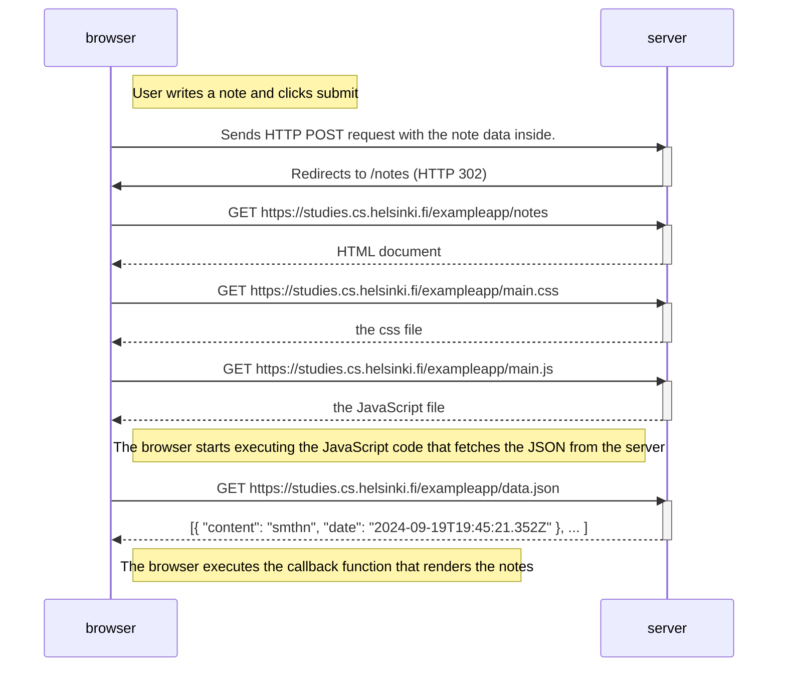

```mermaid
sequenceDiagram
    participant browser
    participant server

    Note right of browser: User writes a note and clicks submit

    browser->>server: Sends HTTP POST request with the note data inside.
    activate server
    server->>browser: Redirects to /notes (HTTP 302) 
    deactivate server

    browser->>server: GET https://studies.cs.helsinki.fi/exampleapp/notes
    activate server
    server-->>browser: HTML document
    deactivate server

    browser->>server: GET https://studies.cs.helsinki.fi/exampleapp/main.css    
    activate server
    server-->>browser: the css file
    deactivate server

    browser->>server: GET https://studies.cs.helsinki.fi/exampleapp/main.js
    activate server
    server-->>browser: the JavaScript file
    deactivate server
    Note right of browser: The browser starts executing the JavaScript code that fetches the JSON from the server

    browser->>server: GET https://studies.cs.helsinki.fi/exampleapp/data.json
    activate server
    server-->>browser: [{ "content": "smthn", "date": "2024-09-19T19:45:21.352Z" }, ... ]
    deactivate server

    Note right of browser: The browser executes the callback function that renders the notes

```