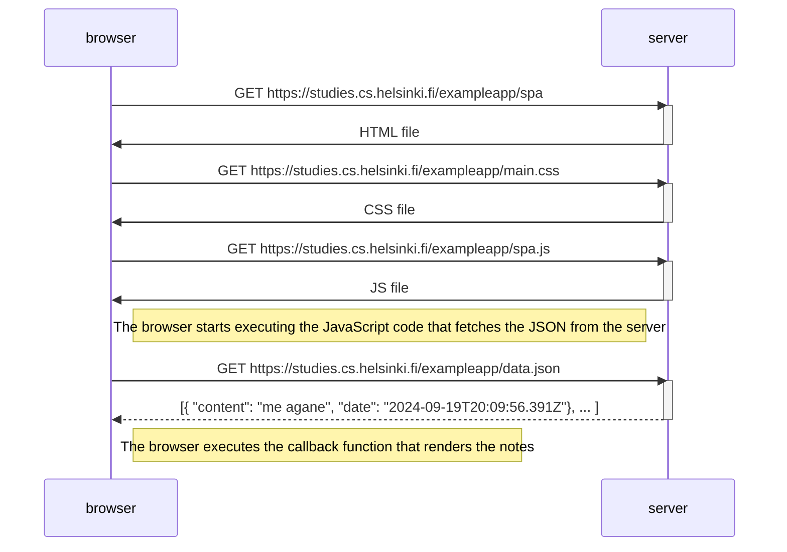

```mermaid
sequenceDiagram
    participant browser
    participant server

    browser->>server: GET https://studies.cs.helsinki.fi/exampleapp/spa
    activate server
    server->>browser: HTML file
    deactivate server

    browser->>server: GET https://studies.cs.helsinki.fi/exampleapp/main.css
    activate server
    server->>browser: CSS file
    deactivate server


    browser->>server: GET https://studies.cs.helsinki.fi/exampleapp/spa.js
    activate server
    server->>browser: JS file
    deactivate server

    Note right of browser: The browser starts executing the JavaScript code that fetches the JSON from the server

    browser->>server: GET https://studies.cs.helsinki.fi/exampleapp/data.json
    activate server
    server-->>browser: [{ "content": "me agane", "date": "2024-09-19T20:09:56.391Z"}, ... ]
    deactivate server

    Note right of browser: The browser executes the callback function that renders the notes


```