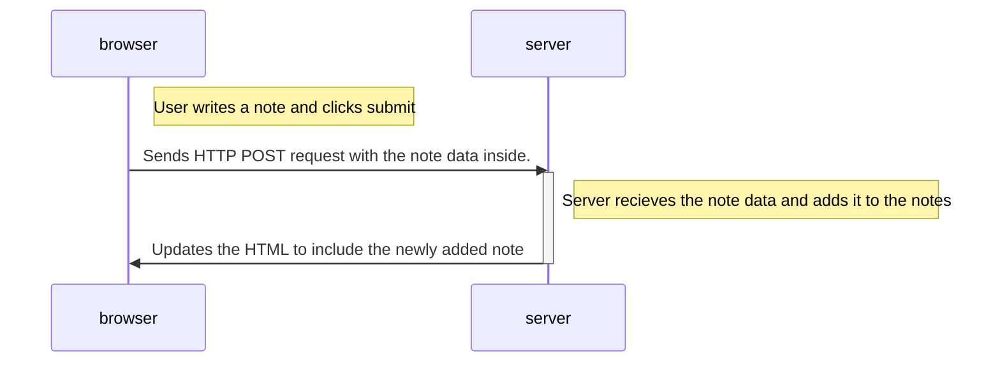

```mermaid
sequenceDiagram
    participant browser
    participant server

    Note right of browser: User writes a note and clicks submit

    browser->>server: Sends HTTP POST request with the note data inside.
    activate server
    Note right of server: Server recieves the note data and adds it to the notes 
    server->>browser: Updates the HTML to include the newly added note
    deactivate server


```